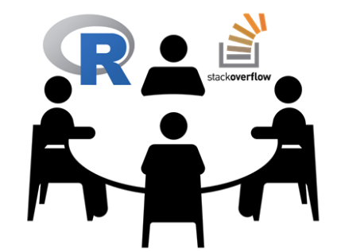

# 2019-n7-R_StackOverflow-Workshop
Meetup held August 20, 2019 showcasing best practices and lessons learned of R Q/A posts on StackOverflow with group workshop to analyze R trends with API data.

## Parfait Gasana, recently awarded R gold badge holder, CRUG co-organizer and data analyst
Presents the ins and outs of StackOverflow with tips on how to ask and how to answer, then invites audience to analyze StackOverflow API data in groups across R posts, users, and tags.

- [R + StackOverflow Overview]()

## Adam Hogan, long-time CRUG member and financial data scientist
Presents interesting StackOverflow trends including basic time series modeling, social network analysis, and simple NLP. Adam will then open with exercises for group workshop.

- [Counts Notebook](https://github.com/Chicago-R-User-Group/2019-n7-R_StackOverflow-Workshop/blob/master/AHogan_counts.ipynb)
- [NLP Notebook](https://github.com/Chicago-R-User-Group/2019-n7-R_StackOverflow-Workshop/blob/master/AHogan_nlp.ipynb)
- [Graph Notebook](https://github.com/Chicago-R-User-Group/2019-n7-R_StackOverflow-Workshop/blob/master/AHogan_graph.ipynb)

---

### Group Workshop Setup

1. Install either popular notebooks with needed dependencies: IPython/Jupyter (with R kernel) or RStudio/R Markdown notebooks.

2. Download either notebook in "Group Notebooks" folder including image icon to working folder.

3. Follow instructions contained at the top of each notebook.
