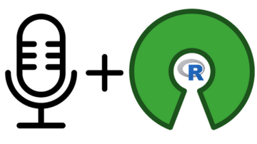
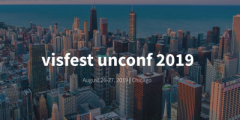
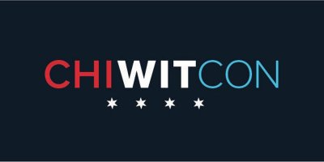

```{r setup, include=FALSE}
knitr::opts_chunk$set(echo = FALSE)
library(RUGtools)
```

## Chicago R User Group (CRUG) ...

- Welcome new and current useRs to 7th meetup of the year!
- Year of Experiments: Lightning Talks, Open Mic, Group Workshop!
- We are The Chicago R User Group launched in 2010!
- Now reached 3,700 members, one of largest groups in world!
- We have an R package, [RUGTools](https://justinmshea.github.io/RUGtools/)!



## Find us:

**Slack**
 
[bit.ly/Slack-CRUG](http://bit.ly/Slack-CRUG)

**Twitter**

[ChicagoRusers](https://twitter.com/ChicagoRusers)

**GitHub**

@[Chicago-R-User-Group](https://github.com/Chicago-R-User-Group)

**Meetup**

[ChicagoRUG](https://www.meetup.com/ChicagoRUG/)

**Website**

[Chicago-r-user-group.github.io](https://chicago-r-user-group.github.io/)

# Local Tech News

## visfest



VisFest is holding our 5th annual VisFest Unconference on August 26-27th, where we bring together the top data visualization practitioners in our community.

- Include scholarship program for minorities, emergent talent, and students. Organization can send up to 2 people.

- Interdisciplinary focus for designers, data analysts and programmers of all kinds.

- Monday and Tuesday, August 26 - 27th, 2019, mHub, 965 W Chicago Ave, Chicago, IL 

http://visfest.com/unconf2019/


## Chicago Women in Tech Conference

<br/>

CHIWITCON™ is an inspiring gathering of technologists from Chicago and beyond. Open to all genders across all platforms and technologies, the CHIWITCON™ brings the achievements, aspirations, and career interests of inspiring individuals in technology to the forefront.

- Congress Plaza Hotel, 520 South Michigan Avenue, Chicago, IL 60605
- September 26, 2019, 9:00 AM – 6:30 PM CDT

https://chiwomenintech.com/


# Anyone hiring R folks? 

# Tonight's Host/Sponsor

## 


Thanks Gogo for awesome space for tonight's meetup!

<br/>


Thanks IBM for sponsoring with food and beverages!


# Tonight's Event

## R + StackOverflow Workshop


**Speakers**

1. **Parfait Gasana**: R + StackOverflow Overview
2. **Adam Hogan**: Exploring the Stackoverflow API in 3 Workbooks

**Workshop**

3. **Group Workshops**: Led by Parfait and Adam
4. **Brief Presentations**: Open to any Group


